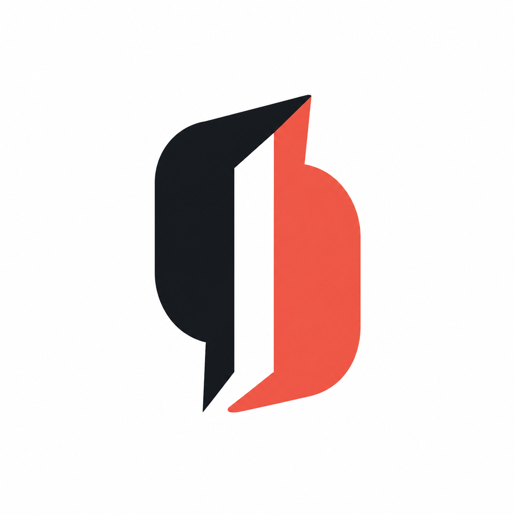

# CandorLens Logo Redesign

Status: Direction C selected and finalized
Date: 2026-08-12

## Why the first mark failed

The original concentric C construction was technically clean but strategically weak. It resembled a generic SaaS icon, relied on its explanation to carry meaning, used a familiar blue technology palette, and did not have a distinctive silhouette. This redesign therefore treats recognizability and an ownable idea as requirements rather than decoration.

## Redesign criteria

- One dominant idea that can be explained in a sentence.
- A silhouette that remains identifiable at favicon size.
- A credible single-color version.
- A human, editorial character rather than a generic technology aesthetic.
- No eyes, camera lenses, concentric rings, microphones, shields, sparkles, or surveillance cues.
- No gradients, shadows, or small details in the production vector.

## Direction A — Dialogue Aperture

Two opposing conversation forms create a vertical opening in negative space. The opening is the lens: clarity is produced between participants rather than imposed by the software. The asymmetric top and bottom cuts give the mark movement and a recognizable silhouette.

Palette: Ink `#171A1F`, Human Coral `#F0645A`.

Strengths: strong brand story, distinctive silhouette, human warmth, and no literal surveillance imagery.
Risk: the pointed terminals can feel more assertive than the product's intended tone.

## Direction B — Candor Ligature

A custom C contains a decisive L. It makes the name itself the source of the symbol and produces the most compact app icon of the three.

Palette: Aubergine Ink `#211B24`, Signal Amber `#F2A93B`.

Strengths: immediate relationship to CandorLens, excellent small-size behavior, and a premium monogram character.  
Risk: the meaning is primarily mnemonic; it says less about conversation than the other directions.

## Direction C — Open Exchange

Two equal conversational ribbons face each other and create an open passage. It represents dialogue becoming a clearer path while keeping both participants visually equal.

Palette: Deep Forest `#173C36`, Warm Mint `#67CFA8`.

Strengths: approachable, balanced, clearly conversational, and directly relevant to both interview participants.
Risk: speech forms are common in collaboration products, so the crossing geometry and central passage must remain intact.

## Selection

**Direction C — Open Exchange** was selected. Its equal conversational forms are the strongest match for a product intended to support both candidates and interviewers, while the central opening communicates clarity without implying observation or surveillance.

The selected concept has been redrawn as deterministic SVG geometry, tested at 16, 24, 32, and 64 pixels, paired with a self-contained outlined wordmark, and delivered in horizontal, reversed, wordmark-only, and monochrome variants. The raster images above remain concept references rather than production logo files.
