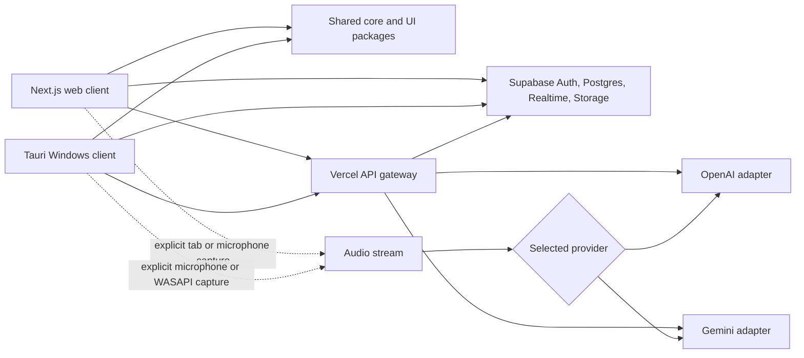

# CandorLens Platform Design

Date: 2026-08-12
Status: Proposed for implementation

## 1. Purpose

Build **CandorLens**, a personal, full-stack interview simulation and interviewer-defense platform with two clients:

- a browser-based web application for authorized browser sessions, preparation, session history, and reports;
- a Windows-first desktop application for authorized microphone and system-audio capture in controlled or disclosed sessions.

The system will reproduce the useful workflow of an interview intelligence assistant through an independent implementation: real-time transcription, conversational context tracking, question detection, document-aware model guidance, session notes, and post-session analysis. It will also provide an interviewer mode that generates follow-up questions and evidence-oriented reports.

## 2. Product Boundary

The product supports authorized mock interviews, disclosed coaching, and consented interviewer analysis. It will not include screen-share bypasses, concealed overlays, evasion of monitoring, hidden recording, or claims that model-use detection is conclusive.

Every capture flow must:

- require an explicit user action to select and start an audio source;
- display a persistent recording/capture indicator;
- store the capture mode and consent acknowledgement on the session;
- provide an immediate stop control;
- default recordings, transcripts, resumes, and reports to private access.

## 3. Scope Decomposition

The platform is too large to implement safely as one undifferentiated change. Work will proceed as four independently testable subprojects, each pushed as a GitHub milestone:

1. Platform foundation: monorepo, design system, authentication, database, storage, and shared domain models.
2. Web application: onboarding, session management, explicit browser capture, live transcript, Coach Lab, and reports.
3. Desktop application: Windows audio-device selection, visible capture controls, shared session experience, and local recovery.
4. Interviewer defense: interviewer prompts, reference-response comparison, explainable signals, and exportable reports.

The platform design in this document governs all four. Each subproject receives its own implementation plan before code is written for that subproject.

## 4. Architecture Options Considered

### Option A: Shared TypeScript monorepo with Next.js and Tauri — selected

Use a pnpm/Turborepo workspace. Next.js powers the Vercel web application. Tauri wraps a React/Vite desktop client and provides a Rust boundary for Windows audio capture. Shared packages hold UI components, domain logic, validation, and model-provider contracts.

Advantages:

- most UI and domain code is shared;
- Tauri produces a smaller desktop application than Electron;
- native audio behavior remains isolated behind a narrow interface;
- web and desktop can evolve without duplicating backend rules.

Trade-offs:

- Tauri introduces Rust and Windows-specific integration work;
- Next.js and Vite require separate application entry points;
- desktop packaging and signing add a later release step.

### Option B: Progressive web application only

Use one Next.js application and browser media APIs for every workflow.

Advantages: smallest codebase and simplest deployment.

Trade-offs: browsers cannot universally capture arbitrary application audio; source selection and platform behavior vary; Teams and Zoom desktop workflows would be incomplete.

### Option C: Next.js plus an independent Electron application

Build a web application and a separate Electron desktop client.

Advantages: desktop development remains entirely JavaScript/TypeScript and OS integrations have a broad ecosystem.

Trade-offs: larger installation size, higher runtime overhead, a larger security surface, and more duplicated application code.

Option A is selected because it gives the best long-term balance of shared code, native capability, performance, and maintainability.

## 5. System Architecture



### Repository layout

```text
apps/
  web/                 Next.js application deployed to Vercel
  desktop/             React/Vite application with src-tauri
packages/
  ui/                  Shared accessible components and design tokens
  core/                Session state, schemas, domain types, and utilities
  models/              Provider-neutral model contracts and adapters
  config/              Shared lint, TypeScript, and test configuration
supabase/
  migrations/          Versioned schema and RLS policies
  functions/           Supabase functions only where they fit the data boundary
docs/
  superpowers/specs/   Approved design specifications
```

## 6. Client Responsibilities

### Web application

- Supabase authentication and account settings.
- Resume, role description, rubric, and supporting-document management.
- Session creation and consent acknowledgement.
- Explicit microphone capture with `getUserMedia`.
- Explicit user-selected browser tab/audio capture with `getDisplayMedia` where the browser supports it.
- Live transcript, detected questions, conversation context, and provider status.
- Coach Lab for controlled simulations.
- Interviewer Mode for follow-up prompts, structured notes, and rubric coverage.
- Session history, search, reports, and exports.

The web application will not claim that it can capture every browser meeting automatically. Unsupported capture combinations must produce clear instructions and fall back to microphone-only capture or uploaded recordings.

### Desktop application

- Windows-first support for microphone and user-selected system-audio devices.
- A persistent visible capture state and stop control.
- Local buffering during short network interruptions.
- Reuse of the shared session, transcript, question, guidance, and report interfaces.
- Secure authentication through the system browser and callback/deep link.
- Automatic upload of recovered session events after connectivity returns.

The first desktop release targets Windows 11. macOS support is a later compatibility milestone and requires a separate audio-permission and packaging review.

## 7. Session Modes

### Coach Lab

For controlled mock interviews or disclosed coaching. It detects interviewer questions and generates concise answer frameworks grounded in the user's uploaded material. Suggestions are treated as prompts to adapt, never as factual claims about experience.

### Interviewer Mode

For an authorized interviewer. It tracks questions already asked, rubric coverage, answer themes, and time allocation. It can propose follow-up questions and produce structured notes. It does not generate candidate answers during the session.

### Defense Analysis

After a session, it compares the transcript with reference answers generated from the same question and context. It reports explainable signals such as phrase overlap, unusually uniform structure, timing patterns, unsupported resume claims, and answer consistency. The result is a review aid, not a cheating verdict.

## 8. Real-Time Data Flow

1. The user creates a session and acknowledges capture consent.
2. The client requests an authorized audio source and starts a visible local capture state.
3. Voice activity detection segments audio into utterances.
4. A streaming transcription provider returns partial and final transcript segments.
5. Final segments enter a conversation-context window.
6. The question detector identifies questions, follow-ups, corrections, and topic changes.
7. Relevant profile, resume, job description, rubric, and document excerpts are retrieved.
8. The selected model provider generates mode-specific output.
9. The client renders incremental results while finalized events are persisted.
10. On session end, background processing creates notes, rubric coverage, metrics, and the final report.

Raw audio is never routed through Supabase Realtime. Realtime is used for durable session/event synchronization. Low-latency audio travels directly to a provider using a short-lived session credential when supported, or through a dedicated authenticated gateway when required.

## 9. Model Provider Design

The application exposes one internal contract for:

- streaming transcription events;
- question and intent detection;
- contextual suggestion generation;
- structured report generation;
- usage and latency metrics.

Gemini and OpenAI adapters implement that contract. The user selects a default provider in settings and may override it per session. Provider API secrets remain server-side. Clients receive only short-lived, scoped session credentials where a provider supports them.

The platform must continue operating in a degraded state if one provider is unavailable: preserve capture locally, keep the transcript where possible, expose a retry action, and allow post-session processing with the alternate provider.

## 10. Supabase Design

### Core tables

- `profiles`: display preferences and default provider; primary key matches the authenticated user.
- `documents`: document metadata, extraction state, ownership, and storage path.
- `interview_profiles`: reusable role, company, job description, rubric, and instructions.
- `sessions`: mode, source, platform, status, consent timestamp, provider, timing, and ownership.
- `utterances`: finalized speaker-attributed transcript segments.
- `questions`: detected questions and their conversation spans.
- `guidance_events`: Coach Lab or Interviewer Mode outputs with provider and latency metadata.
- `reports`: versioned post-session summaries and defense analysis.
- `usage_events`: provider usage, duration, and estimated cost metadata.

Every public table enables RLS. The profile policy uses `auth.uid() = id`; other owned tables use `auth.uid() = user_id` checks for select, insert, update, and delete operations. Update policies include both `USING` and `WITH CHECK`. Authorization does not rely on user-editable metadata.

### Storage buckets

- `documents`: private resumes, job descriptions, rubrics, and supporting files.
- `recordings`: private optional session recordings.
- `exports`: private generated PDF/JSON/CSV reports with time-limited download URLs.

Storage paths begin with the authenticated user ID. Policies restrict all operations to the owning user. Service-role or secret keys are never exposed to either client.

## 11. Vercel Design

Vercel hosts the Next.js web application and short-lived API routes for:

- creating scoped provider sessions;
- document ingestion orchestration;
- non-streaming model requests;
- post-session report jobs that fit function execution limits;
- signed export initiation.

Supabase remains the system of record and object-storage service. Environment variables are synchronized through the authorized Vercel/Supabase integration. Long-lived audio sockets are not implemented as conventional Vercel serverless functions; clients connect using provider-supported real-time protocols and short-lived credentials.

## 12. Brand, UI, and UX System

CandorLens uses the brand idea **“See the conversation clearly.”** Its concentric open-arc mark represents candid conversation, contextual focus, and human judgment. The interface uses a professional operations-dashboard style:

- light-first neutral surfaces with optional dark mode;
- navy primary text and controls, blue primary actions, and accessible semantic status colors;
- Fira Sans for interface text and headings;
- Fira Code only for timestamps, code, metrics, and transcript metadata;
- an 8-pixel spacing rhythm and token-driven color, typography, radius, elevation, and motion;
- Phosphor SVG icons with consistent stroke and sizing;
- visible focus rings, full keyboard navigation, reduced-motion support, and a minimum 4.5:1 text contrast;
- restrained 150–300 ms transitions using transform and opacity only;
- desktop sidebar navigation that collapses to a compact mobile navigation pattern.

Primary web screens:

1. Sign in and onboarding.
2. Dashboard with recent sessions, usage, and readiness actions.
3. Interview profile and document library.
4. Session setup with capture and consent checks.
5. Live session workspace with transcript, detected question, and mode-specific guidance.
6. Session detail with transcript search and event timeline.
7. Defense report with evidence cards and uncertainty labels.
8. Provider, privacy, retention, and export settings.

The desktop client shares screens 3–5 and a compact connection/settings view.

The production logo variants and usage rules live in `assets/brand/` and `docs/brand-guidelines.md`. Archived concepts are retained for design provenance but are not used as production marks.

## 13. Privacy, Retention, and Security

- All document, recording, transcript, and report data is private by default.
- Recording is optional; transcript-only sessions are supported.
- The user can define a retention period and delete a session with its related storage objects.
- Provider secrets are stored only in server-managed environment secrets.
- Logs exclude raw resume contents, transcript text, audio, access tokens, and provider keys.
- Uploads enforce allow-listed MIME types and size limits.
- Document extraction treats uploaded content as untrusted data and does not execute embedded instructions.
- The application records the model provider and model used for each generated artifact.
- Defense reports show confidence and supporting evidence and prohibit automatic adverse decisions.

## 14. Error Handling and Recovery

- Permission denied: explain the missing browser/OS permission and offer a retry or alternate capture source.
- Capture source ends: finalize buffered segments, mark the session interrupted, and keep the report recoverable.
- Network interruption: buffer bounded encrypted session events locally and retry with idempotency keys.
- Provider timeout: retain transcript context, show retry/fallback controls, and never invent a response.
- Supabase write failure: queue durable client events and reconcile by event ID after reconnect.
- Document ingestion failure: keep the original private upload, expose a retry, and display the precise failed stage.
- Partial report failure: save completed sections and allow regenerating only the failed section.

## 15. Testing and Verification

### Automated tests

- Unit tests for session state, question boundaries, provider adapters, data redaction, and cost calculations.
- Contract tests using recorded provider event fixtures; no live paid API calls in the default test suite.
- React component and accessibility tests for shared UI.
- Playwright end-to-end tests for authentication, uploads, session setup, transcript events, reports, and settings.
- Rust unit/integration tests for desktop capture state and buffer recovery.
- Supabase migration reset, schema lint, RLS ownership tests, storage-policy tests, and database advisors.
- Next.js typecheck, lint, unit tests, and production build.
- Tauri frontend build, Rust checks, and Windows packaging smoke test.

### Manual verification

- Chrome and Edge microphone capture.
- Chrome user-selected tab-audio capture with clear unsupported-state behavior.
- Windows 11 microphone and loopback-device selection.
- Network loss and recovery during a session.
- Keyboard-only navigation, reduced motion, and light/dark contrast.
- End-to-end session synchronization between web and desktop clients.

## 16. Deployment and GitHub Workflow

- Each completed, verified milestone is committed and pushed to GitHub.
- Branch names use neutral conventional prefixes such as `feature/*`, `fix/*`, `design/*`, and `docs/*`; workflow or tool attribution is never included.
- Vercel preview deployments are used for web review before production promotion.
- Supabase schema changes are created as versioned local migrations and verified locally before remote application.
- Production deployment, paid-provider activation, and destructive remote database operations require explicit confirmation at the point of action.

## 17. Completion Criteria

The first complete release is achieved when:

- one account can authenticate and manage private documents;
- both clients can create and synchronize sessions;
- supported authorized audio sources produce a live transcript;
- questions and conversational context are detected reliably on test fixtures;
- Gemini and OpenAI can be selected through the same provider interface;
- Coach Lab and Interviewer Mode produce their intended, distinct outputs;
- post-session notes and defense analysis are stored and viewable;
- permission, provider, network, and persistence failures have recoverable UX;
- all automated and manual verification listed above passes;
- web preview deployment and a Windows desktop build are available for review;
- the CandorLens name, logo variants, and brand guidelines are consistently applied across both clients.
